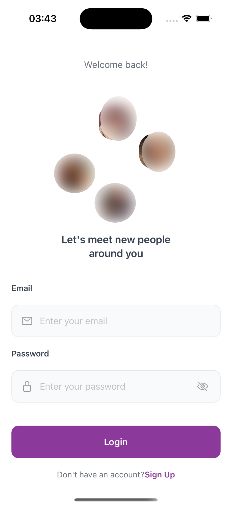
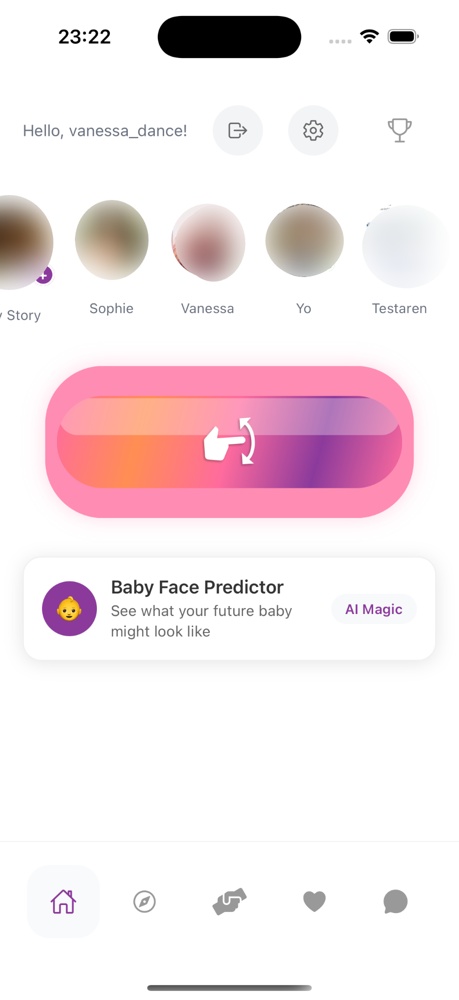
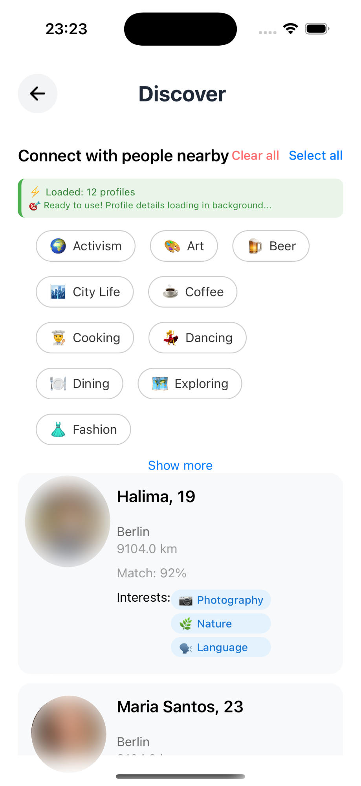
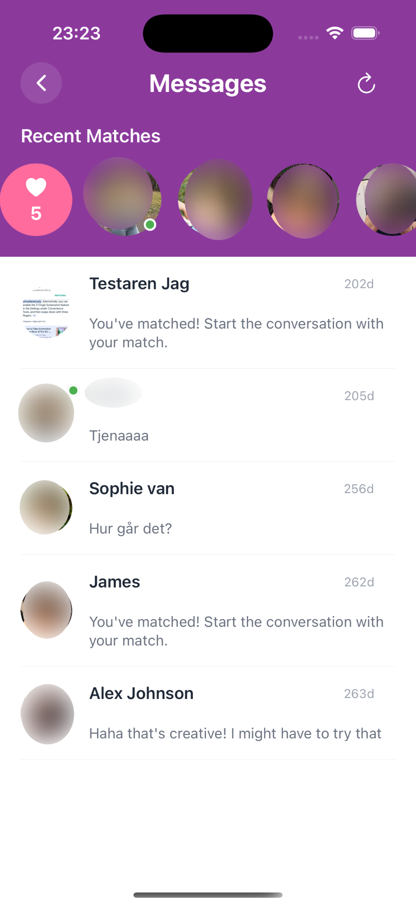

# Modern Dating App

A full-stack dating application with swipe matching, real-time messaging, stories, and professional dating coaches.

## Tech Stack

**Frontend:** React Native (Expo) • TypeScript • React Navigation • JWT Auth

**Backend:** C# .NET 8 • Minimal APIs • PostgreSQL • Npgsql

**Features:** Real-time presence tracking • Background services • RESTful API design

## Key Features

- **JWT Authentication** - Secure login/registration system
- **Rich Profiles** - Multiple photos, bio, interests, location-based matching
- **Real-time Messaging** - Chat with matches, read receipts, conversation threading
- **Swipe Discovery** - Tinder-style card swiping (like/pass/super like)
- **Stories** - Instagram-style 24-hour expiring stories
- **Dating Coaches** - Book sessions with professional relationship coaches
- **Activity Feed** - Share personality cards, like and comment on posts
- **Online Status** - Real-time presence tracking with heartbeat system

## Project Stats

- **15+ Database Tables** with proper indexing and relationships
- **40+ API Endpoints** covering all major features
- **10+ Mobile Screens** with smooth navigation
- **5,000+ Lines** of TypeScript/React Native code
- **2,000+ Lines** of C# backend code

## Screenshots

  
  
  
  
  

---

**Built with React Native, TypeScript, .NET, and PostgreSQL**
